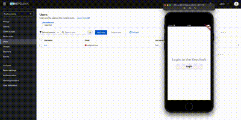

# Preview

# How to run

### Pre-requisites:

- Docker
- Flutter 3.19.3
- Dart 3.3.1

### Keycloak

1. `cd keycloak`

2. `docker-compose.yaml up -d`

### Create user :

1. Open admin console `http://localhost:8080`

   - username: admin
   - password: admin

2. Selecting realm `heyboonsong`
3. Go to users (sidebar) -> add user
4. Open Credentials tab and set password

### Flutter

1. `cd mobile_app`
2. `flutter run`
